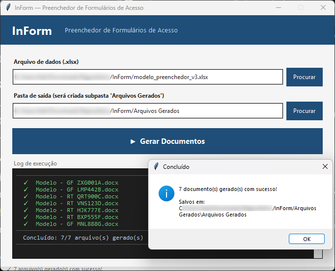

# InForm — Preenchedor de Formulários de Acesso

Ferramenta desktop desenvolvida para automatizar o preenchimento de formulários Word a partir de dados extraídos de planilhas Excel.

O projeto foi criado para otimizar tarefas repetitivas relacionadas à solicitação de acessos em operações do setor de telecomunicações.

---

## Interface



---

## Funcionalidades

- Leitura automática de dados via planilha Excel
- Geração automática de formulários `.docx`
- Suporte a formulários Greenfield (GF) e Rooftop (RT)
- Criação de um documento por site
- Nomeação automática dos arquivos
- Duplicação automática das linhas da equipe conforme quantidade de técnicos
- Preenchimento automático da data atual nos formulários RT
- Interface gráfica simples e intuitiva

---

## Como usar

1. Preencha a planilha `modelo_preenchedor.xlsx`
2. Execute o `InForm.exe`
3. Selecione o arquivo Excel
4. Escolha a pasta de saída
5. Clique em **Gerar Documentos**

Os documentos serão gerados automaticamente na subpasta `Arquivos Gerados`.

---

## Estrutura esperada

```text
📁 sua-pasta/
├── InForm.exe
├── modelo_preenchedor.xlsx
├── Modelo_GF.docx
└── Modelo_RT.docx
```

---

## Placeholders suportados

| Placeholder | Descrição |
|---|---|
| `{{SITE}}` | Código do site |
| `{{PERIODO}}` | Período de acesso |
| `{{ATIVIDADE}}` | Descrição da atividade |
| `{{ENDERECO}}` | Endereço do site |
| `{{DATA}}` | Data atual por extenso |
| `{{EMAIL}}` | E-mail do técnico |
| `{{NOME}}` | Nome completo |
| `{{RG}}` | RG |
| `{{CPF}}` | CPF |
| `{{EMPRESA}}` | Empresa |

---

## Tecnologias utilizadas

- Python 3.12
- tkinter
- pandas
- openpyxl
- python-docx
- PyInstaller

---

## Objetivo do projeto

Este projeto nasceu de uma necessidade real do cotidiano profissional: automatizar o preenchimento de dezenas de formulários de acesso, reduzindo trabalho manual repetitivo e tempo operacional.

Além da automação em si, o projeto também serviu como prática de desenvolvimento, organização de lógica, manipulação de arquivos e integração entre interface gráfica e processamento de dados.

---

## Observações

Este repositório contém uma versão adaptada para publicação pública, sem informações sensíveis ou dados internos da empresa.

O desenvolvimento contou com apoio de IA como ferramenta auxiliar durante a implementação do projeto.